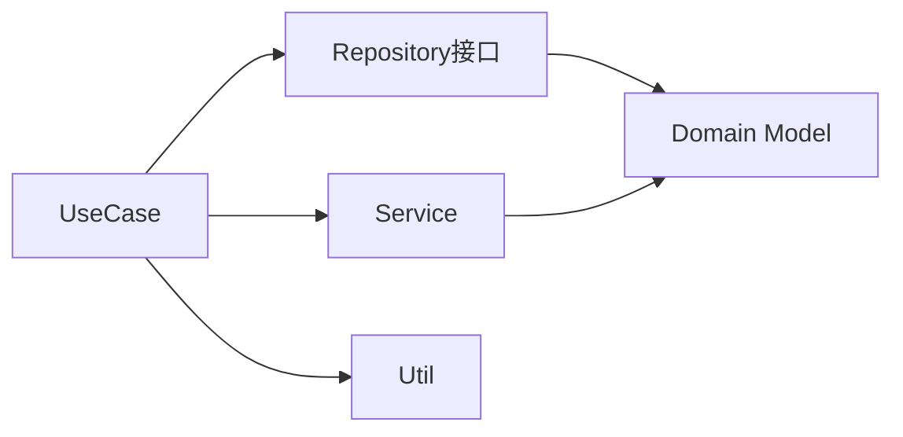

# Domain 层文档

> [根目录](../../../CLAUDE.md) > [项目文档](../README.md) > **domain**

## 层级职责

Domain层是业务逻辑的核心，遵循Clean Architecture原则：
- **纯业务逻辑**: 不依赖任何Android框架
- **领域模型**: 定义核心业务实体
- **业务规则**: 实现业务逻辑和验证
- **用例封装**: 将业务操作封装为可复用的用例

## 模块结构

### [model](model/)
- **职责**: 定义核心业务实体
- **特点**: 纯Kotlin类，无Android依赖
- **示例**: ContactProfile, ChatMessage, AnalysisResult

### [repository](repository/)
- **职责**: 定义数据访问接口
- **特点**: 抽象接口，由data层实现
- **示例**: ContactRepository, BrainTagRepository

### [usecase](usecase/)
- **职责**: 封装具体业务操作
- **特点**: 单一职责，可组合使用
- **示例**: AnalyzeChatUseCase, SaveProfileUseCase

### [service](service/)
- **职责**: 处理复杂业务逻辑
- **特点**: 跨多个实体的业务服务
- **示例**: PrivacyEngine, RuleEngine, SessionContextService

### [util](util/)
- **职责**: 提供领域工具类
- **特点**: 通用功能，业务相关
- **示例**: ErrorHandler, SystemPrompts

## 设计原则

1. **依赖倒置**: 依赖抽象接口，不依赖具体实现
2. **单一职责**: 每个类只有一个变化的理由
3. **开闭原则**: 对扩展开放，对修改关闭
4. **接口隔离**: 避免胖接口，保持接口简洁

## 核心业务流程

## 注意事项

- 严禁在domain层使用Android框架类
- 所有异步操作应使用suspend函数
- 错误处理使用Result类型或自定义异常

## 相关文件清单

### 模型文件
- `ChatMessage.kt` - 聊天消息模型
- `ContactProfile.kt` - 联系人画像模型
- `AnalysisResult.kt` - 分析结果模型
- `AppError.kt` - 应用错误定义

### 仓库接口
- `ContactRepository.kt` - 联系人仓库接口
- `BrainTagRepository.kt` - 脑标签仓库接口

### 用例文件
- `AnalyzeChatUseCase.kt` - 聊天分析用例
- `SaveProfileUseCase.kt` - 保存画像用例
- `GenerateReplyUseCase.kt` - 生成回复用例

### 服务文件
- `PrivacyEngine.kt` - 隐私处理引擎
- `RuleEngine.kt` - 规则引擎
- `SessionContextService.kt` - 会话上下文服务

## 变更记录

### 2025-12-21 - 初始创建
- 创建domain层文档
- 定义模块结构和设计原则