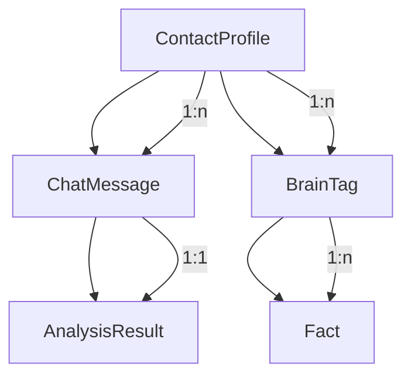

# Domain Model 模块文档

> [根目录](../../../../CLAUDE.md) > [项目文档](../../README.md) > [domain](../README.md) > **model**

## 模块职责

Domain Model模块定义了应用的核心业务实体，这些实体：
- **纯粹业务**: 不包含任何Android框架依赖
- **自包含**: 每个模型封装自己的业务逻辑
- **可序列化**: 支持数据持久化和网络传输
- **类型安全**: 使用Kotlin类型系统确保数据完整性

## 核心模型

### ContactProfile
- **文件**: `ContactProfile.kt`
- **描述**: 联系人画像模型，包含联系人的所有相关信息
- **关键字段**:
  - id: 唯一标识符
  - name: 联系人姓名
  - relationshipLevel: 关系亲密度
  - tags: 标签列表
  - facts: 事实记录
  - lastUpdated: 最后更新时间

### ChatMessage
- **文件**: `ChatMessage.kt`
- **描述**: 聊天消息模型，表示单条聊天记录
- **关键字段**:
  - id: 消息ID
  - content: 消息内容
  - timestamp: 时间戳
  - isFromMe: 是否来自用户
  - contactId: 关联联系人ID

### AnalysisResult
- **文件**: `AnalysisResult.kt`
- **描述**: AI分析结果模型
- **关键字段**:
  - emotion: 情感分析
  - intent: 意图识别
  - suggestions: 建议列表
  - confidence: 置信度

### AppError
- **文件**: `AppError.kt`
- **描述**: 应用错误定义
- **特点**:
  - 密封类设计，类型安全
  - 包含错误代码和消息
  - 支持错误链追踪

## 设计原则

### 1. 值对象优先
- 使用data class表示值对象
- 实现equals/hashCode/toString
- 保持不可变性

### 2. 业务逻辑内聚
- 模型包含自己的业务规则
- 提供验证方法
- 封装计算逻辑

### 3. 类型系统利用
- 使用密封类表示有限类型
- 使用枚举表示固定选项
- 使用内联类避免原始类型偏执

## 模型关系图

## 验证策略

### 输入验证
- 使用require检查参数
- 提供默认值
- 明确错误信息

### 业务规则验证
- 模型内建验证方法
- 返回ValidationResult
- 支持批量验证

## 扩展指南

1. **新增模型**:
   - 继承BaseModel（如有）
   - 实现必要接口
   - 添加测试用例

2. **修改模型**:
   - 考虑向后兼容
   - 更新序列化逻辑
   - 迁移现有数据

3. **添加关系**:
   - 使用ID引用
   - 避免循环依赖
   - 提供查询方法

## 相关文件清单

### 核心模型
- `ContactProfile.kt` - 联系人画像
- `ChatMessage.kt` - 聊天消息
- `AnalysisResult.kt` - 分析结果
- `AppError.kt` - 错误定义

### 辅助模型
- `AiProvider.kt` - AI服务商
- `FactKeys.kt` - 事实键定义
- `RelationshipLevel.kt` - 关系级别
- `SafetyCheckResult.kt` - 安全检查结果

## 变更记录

### 2025-12-21 - 初始创建
- 创建domain model文档
- 记录核心模型和设计原则