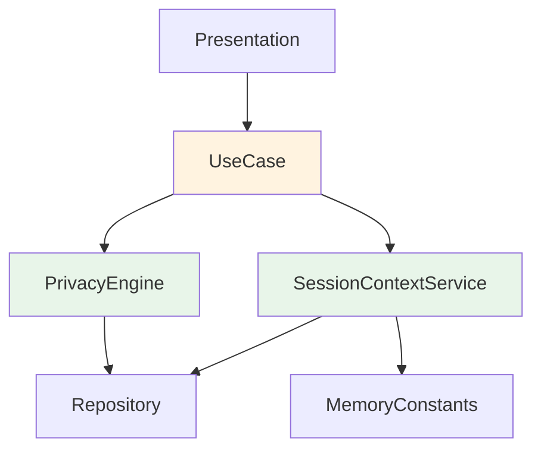

# Domain Service 模块文档

> [根目录](../../../../CLAUDE.md) > [项目文档](../../README.md) > [domain](../README.md) > **service**

## 模块职责

Domain Service模块提供跨多个实体的复杂业务逻辑处理：
- **复杂业务逻辑**: 处理涉及多个领域模型的业务场景
- **领域服务**: 提供可复用的业务能力
- **状态管理**: 管理跨实体的业务状态
- **业务编排**: 协调多个UseCase完成复杂流程

## 核心服务

### PrivacyEngine（隐私引擎）

> 文件: `PrivacyEngine.kt`

**职责**: 数据脱敏与隐私保护

**核心功能**:
- **数据脱敏**: 检测并替换敏感信息（姓名、电话、身份证等）
- **隐私检查**: 验证数据是否符合隐私要求
- **脱敏规则管理**: 管理自定义脱敏规则

**主要方法**:
```kotlin
suspend fun sanitize(content: String): SanitizedResult
suspend fun checkPrivacy(content: String): PrivacyCheckResult
fun addSanitizationRule(rule: SanitizationRule)
```

**使用场景**:
- 发送数据到AI前进行脱敏
- 验证用户输入是否包含敏感信息
- 导出数据时保护隐私

### SessionContextService（会话上下文服务）

> 文件: `SessionContextService.kt`

**职责**: 管理AI对话的会话上下文

**核心功能**:
- **上下文维护**: 维护对话历史的上下文窗口
- **上下文压缩**: 智能压缩长对话上下文
- **多会话管理**: 支持多个并发会话
- **上下文清理**: 自动清理过期上下文

**主要方法**:
```kotlin
suspend fun getContext(sessionId: String): SessionContext
suspend fun updateContext(sessionId: String, message: ChatMessage)
suspend fun compressContext(sessionId: String): CompressedContext
suspend fun clearContext(sessionId: String)
```

**使用场景**:
- AI对话时维护历史上下文
- 长对话的上下文压缩
- 多联系人并发对话管理

## 设计原则

### 1. 无状态设计
- 服务本身应该是无状态的
- 状态通过参数传递或从Repository获取
- 避免在Service中存储可变状态

### 2. 单一职责
- 每个Service专注于一个业务领域
- 避免Service之间的直接依赖
- 通过UseCase组合多个Service

### 3. 可测试性
- Service应该易于单元测试
- 依赖通过构造函数注入
- 提供Mock实现用于测试

## 服务架构



## 使用示例

### PrivacyEngine使用示例

```kotlin
@HiltViewModel
class ChatViewModel @Inject constructor(
    private val privacyEngine: PrivacyEngine,
    private val analyzeChatUseCase: AnalyzeChatUseCase
) : ViewModel() {

    fun analyzeChat(content: String) {
        viewModelScope.launch {
            // 1. 数据脱敏
            val sanitizedResult = privacyEngine.sanitize(content)
            if (sanitizedResult.hasSensitiveData) {
                _uiState.update { it.copy(
                    privacyWarning = sanitizedResult.warningMessage
                )}
            }

            // 2. 使用脱敏后的内容进行分析
            val result = analyzeChatUseCase(
                sanitizedResult.sanitizedContent
            )
            // ... 处理结果
        }
    }
}
```

### SessionContextService使用示例

```kotlin
class ChatSessionManager @Inject constructor(
    private val sessionContextService: SessionContextService,
    private val saveMessageUseCase: SaveMessageUseCase
) {

    suspend fun processMessage(
        sessionId: String,
        message: ChatMessage
    ): ProcessResult {
        // 1. 获取当前上下文
        val context = sessionContextService.getContext(sessionId)

        // 2. 检查是否需要压缩
        if (context.needsCompression()) {
            sessionContextService.compressContext(sessionId)
        }

        // 3. 更新上下文
        sessionContextService.updateContext(sessionId, message)

        // 4. 保存消息
        saveMessageUseCase(message)

        return ProcessResult.Success
    }
}
```

## 扩展指南

### 创建新Service

1. **确定职责**: 明确Service的业务边界
2. **定义接口**: 声明公共方法
3. **实现逻辑**: 编写核心业务逻辑
4. **添加测试**: 编写单元测试
5. **文档编写**: 更新模块文档

### Service与UseCase的选择

**使用Service的场景**:
- 跨多个实体的复杂逻辑
- 需要维护状态的长时间操作
- 可被多个UseCase复用的能力

**使用UseCase的场景**:
- 单一的业务操作
- 无状态的函数式操作
- 表示用户意图的用例

## 性能考虑

### PrivacyEngine优化
- 使用正则表达式缓存
- 并行处理多个脱敏规则
- 预编译常用模式

### SessionContextService优化
- 使用LRU缓存限制上下文数量
- 异步清理过期上下文
- 增量更新而非全量重建

## 相关文件清单

### 服务实现
- `PrivacyEngine.kt` - 隐私引擎服务
- `SessionContextService.kt` - 会话上下文服务

### 相关依赖
- `MemoryConstants.kt` - 内存常量配置
- `SanitizationRule.kt` - 脱敏规则定义

## 变更记录

### 2025-12-25 - 初始创建
- 创建domain/service模块文档
- 记录PrivacyEngine和SessionContextService
- 定义设计原则和最佳实践
