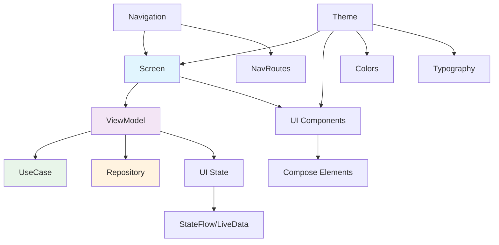

# Presentation 层文档

> [根目录](../../../CLAUDE.md) > [项目文档](../README.md) > **presentation**

## 层级职责

Presentation层负责用户界面的实现和交互，采用MVVM架构：
- **UI展示**: 使用Jetpack Compose构建声明式UI
- **状态管理**: 通过ViewModel管理UI状态
- **用户交互**: 处理用户输入和操作
- **导航管理**: 控制页面跳转和导航

## 模块结构

### [ui](ui/)
- **职责**: UI组件实现
- **技术**: Jetpack Compose
- **组件**:
  - screen - 页面级组件
  - component - 可复用UI组件
  - theme - 主题和样式

### [viewmodel](viewmodel/)
- **职责**: MVVM架构的ViewModel层
- **功能**:
  - UI状态管理
  - 业务逻辑协调
  - 数据转换

### [navigation](navigation/)
- **职责**: 导航系统
- **功能**:
  - 路由定义
  - 导航控制
  - 深度链接

### [theme](theme/)
- **职责**: 应用主题配置
- **功能**:
  - 颜色系统
  - 字体排版
  - 形状定义

## 架构图



## MVVM实现

### 1. ViewModel模式
```kotlin
@HiltViewModel
class ExampleViewModel @Inject constructor(
    private val useCase: ExampleUseCase
) : BaseViewModel() {

    private val _uiState = MutableStateFlow(ExampleUiState())
    val uiState: StateFlow<ExampleUiState> = _uiState.asStateFlow()

    fun onEvent(event: ExampleUiEvent) {
        when (event) {
            // 处理事件
        }
    }
}
```

### 2. State管理
- 使用StateFlow/SharedFlow
- 单一数据源原则
- 不可变状态

### 3. 事件处理
- UI事件传递给ViewModel
- 业务逻辑在ViewModel中执行
- 状态更新驱动UI变化

## UI组件体系

### Screen组件
- **ChatScreen** - 聊天界面
- **ContactListScreen** - 联系人列表
- **SettingsScreen** - 设置界面
- **UserProfileScreen** - 用户画像

### Component组件
- **MessageBubble** - 消息气泡
- **AnalysisCard** - 分析卡片
- **PrimaryButton** - 主按钮
- **CustomTextField** - 自定义输入框

### Layout组件
- **LoadingIndicator** - 加载指示器
- **EmptyView** - 空状态视图
- **ErrorView** - 错误视图

## 主题系统

### 颜色系统
- Material3颜色规范
- 支持深色模式
- 动态颜色适配

### 字体系统
- 统一字体规范
- 响应式字体大小
- 支持自定义字体

## 导航设计

### 导航结构
```kotlin
NavHost(
    navController = navController,
    startDestination = "chat"
) {
    composable("chat") { ChatScreen() }
    composable("contacts") { ContactListScreen() }
    composable("settings") { SettingsScreen() }
    composable("profile/{id}") { UserProfileScreen(it) }
}
```

### 导航原则
- 单一Activity架构
- Compose Navigation
- 类型安全的路由

## 性能优化

### 1. Compose优化
- 使用remember缓存计算结果
- 避免不必要的重组
- 懒加载列表

### 2. 状态优化
- 派生状态使用derivedStateOf
- 合理使用stateIn
- 避免状态泄漏

### 3. 内存管理
- 及时注销监听器
- 使用DisposableEffect
- 监控内存使用

## 相关文件清单

### Screen实现
- `ChatScreen.kt` - 聊天界面
- `ContactListScreen.kt` - 联系人列表
- `SettingsScreen.kt` - 设置界面
- `UserProfileScreen.kt` - 用户画像

### ViewModel实现
- `ChatViewModel.kt` - 聊天ViewModel
- `ContactListViewModel.kt` - 联系人ViewModel
- `SettingsViewModel.kt` - 设置ViewModel
- `BaseViewModel.kt` - ViewModel基类

### Component实现
- `MessageBubble.kt` - 消息气泡
- `AnalysisCard.kt` - 分析卡片
- `PrimaryButton.kt` - 主按钮
- `LoadingIndicator.kt` - 加载指示器

## 变更记录

### 2025-12-21 - 初始创建
- 创建presentation层文档
- 定义MVVM架构实现
- 记录UI组件体系和性能优化策略