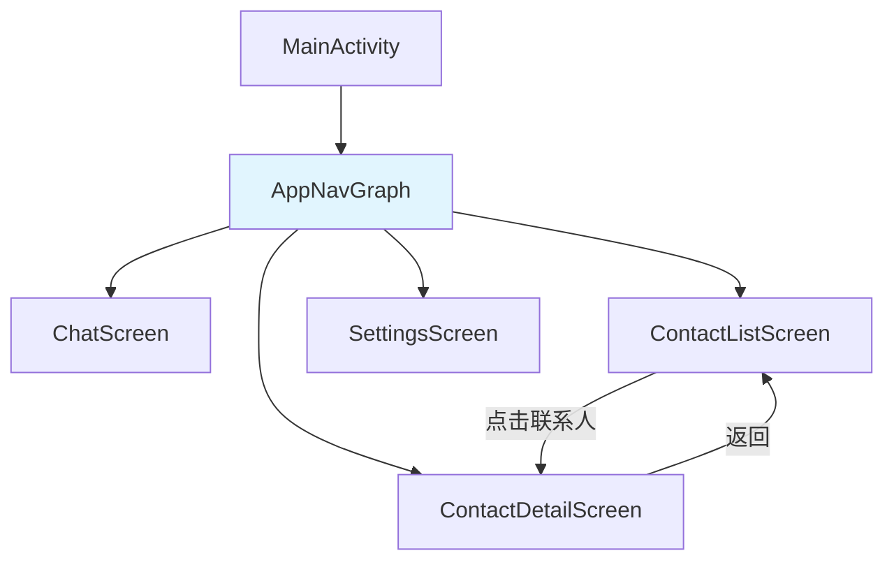

# Presentation Navigation 模块文档

> [根目录](../../../../CLAUDE.md) > [项目文档](../../README.md) > [presentation](../README.md) > **navigation**

## 模块职责

Presentation Navigation模块负责应用导航系统：
- **路由定义**: 定义所有导航路由
- **导航图**: NavGraph配置
- **深度链接**: 处理深度链接
- **类型安全**: 提供类型安全的导航

## 核心组件

### NavRoutes
- **文件**: `NavRoutes.kt`
- **职责**: 导航路由定义
- **功能**:
  - 路由常量定义
  - 参数定义
  - 路由构建

### NavGraph
- **文件**: `NavGraph.kt`
- **职责**: 导航图配置
- **功能**:
  - 页面注册
  - 导航关系定义
  - 参数传递

## 路由定义

### 主路由

| 路由 | 路径 | 参数 |
|------|------|------|
| CHAT | "chat" | - |
| CONTACTS | "contacts" | - |
| CONTACT_DETAIL | "contact_detail/{id}" | id: String |
| SETTINGS | "settings" | - |
| PROMPT_EDITOR | "prompt_editor" | - |
| BRAIN_TAGS | "brain_tags" | - |

### 辅助路由

| 路由 | 路径 | 参数 |
|------|------|------|
| AI_CONFIG | "ai_config" | - |
| USER_PROFILE | "user_profile" | - |
| TOPICS | "topics" | - |

## 使用示例

### NavRoutes定义

```kotlin
object NavRoutes {
    const val CHAT = "chat"
    const val CONTACTS = "contacts"
    const val CONTACT_DETAIL = "contact_detail/{id}"

    const val CONTACT_ID_ARG = "id"

    fun contactDetail(id: String): String {
        return "contact_detail/$id"
    }
}
```

### NavGraph配置

```kotlin
@Composable
fun AppNavGraph(
    navController: NavHostController,
    startDestination: String = NavRoutes.CONTACTS
) {
    NavHost(
        navController = navController,
        startDestination = startDestination
    ) {
        composable(NavRoutes.CHAT) {
            ChatScreen(
                onNavigateBack = { navController.popBackStack() }
            )
        }

        composable(NavRoutes.CONTACTS) {
            ContactListScreen(
                onContactClick = { id ->
                    navController.navigate(NavRoutes.contactDetail(id))
                }
            )
        }

        composable(
            route = NavRoutes.CONTACT_DETAIL,
            arguments = listOf(
                navArgument(NavRoutes.CONTACT_ID_ARG) {
                    type = NavType.StringType
                }
            )
        ) { backStackEntry ->
            val contactId = backStackEntry.arguments?.getString(NavRoutes.CONTACT_ID_ARG)
            ContactDetailScreen(
                contactId = contactId ?: "",
                onNavigateBack = { navController.popBackStack() }
            )
        }
    }
}
```

### 导航调用

```kotlin
// 简单导航
navController.navigate(NavRoutes.SETTINGS)

// 带参数导航
navController.navigate(NavRoutes.contactDetail(contactId))

// 返回上一页
navController.popBackStack()

// 返回到指定路由
navController.popBackStack(NavRoutes.CONTACTS, inclusive = false)
```

## 设计原则

### 1. 类型安全
- 使用类型安全的参数
- 避免硬编码字符串
- 使用导航DSL

### 2. 单一Activity
- 只有一个Activity
- 所有页面通过Compose实现
- 导航由Compose Navigation管理

### 3. 深度链接支持
- 支持外部深度链接
- 正确处理返回栈
- 参数验证

## 导航架构



## 相关文件清单

### 导航配置
- `NavRoutes.kt` - 路由定义
- `NavGraph.kt` - 导航图配置

## 变更记录

### 2025-12-25 - 初始创建
- 创建presentation/navigation模块文档
