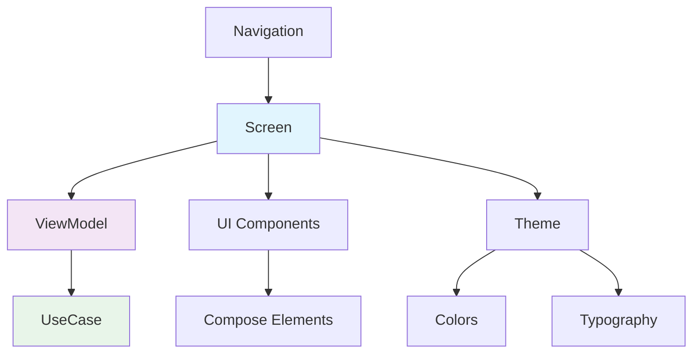

# Presentation UI 模块文档

> [根目录](../../../../CLAUDE.md) > [项目文档](../../README.md) > [presentation](../README.md) > **ui**

## 模块职责

Presentation UI模块负责用户界面的实现：
- **页面实现**: 主要功能页面
- **UI组件**: 可复用的UI组件
- **交互处理**: 用户交互逻辑
- **状态展示**: UI状态渲染

## 页面结构 (Screen)

### 主要页面

#### ChatScreen
- **文件**: `screen/chat/ChatScreen.kt`
- **职责**: 聊天界面
- **功能**: 消息列表、输入框、发送

#### ContactListScreen
- **文件**: `screen/contact/ContactListScreen.kt`
- **职责**: 联系人列表
- **功能**: 列表展示、搜索、筛选

#### ContactDetailScreen
- **文件**: `screen/contact/ContactDetailScreen.kt`
- **职责**: 联系人详情
- **功能**: 四标签页（概览、画像、事实流、人格）

#### SettingsScreen
- **文件**: `screen/settings/SettingsScreen.kt`
- **职责**: 设置界面
- **功能**: AI配置、隐私设置、主题切换

#### PromptEditorScreen
- **文件**: `screen/prompt/PromptEditorScreen.kt`
- **职责**: 提示词编辑器
- **功能**: 模板编辑、变量定义、预览

#### BrainTagScreen
- **文件**: `screen/tag/BrainTagScreen.kt`
- **职责**: 脑标签管理
- **功能**: 标签CRUD、分类管理

### MainScreen
- **文件**: `screen/MainScreen.kt`
- **职责**: 主界面框架
- **功能**: 底部导航、页面容器

## UI组件 (Component)

### 按钮组件
- `PrimaryButton.kt` - 主要按钮
- `SecondaryButton.kt` - 次要按钮
- `IconButton.kt` - 图标按钮

### 输入组件
- `CustomTextField.kt` - 自定义输入框
- `SearchBar.kt` - 搜索栏
- `MultilineTextField.kt` - 多行输入框

### 列表组件
- `ContactListItem.kt` - 联系人列表项
- `FactListItem.kt` - 事实列表项
- `TagListItem.kt` - 标签列表项

### 卡片组件
- `AnalysisCard.kt` - 分析结果卡片
- `FactCard.kt` - 事实卡片
- `ProfileCard.kt` - 画像卡片

### 状态组件
- `EmptyView.kt` - 空状态视图
- `LoadingSkeleton.kt` - 加载骨架
- `FriendlyErrorCard.kt` - 错误提示

### 动画组件
- `animation/` - 动画组件目录
- `FadeInAnimation.kt` - 淡入动画
- `SlideInAnimation.kt` - 滑入动画

### iOS风格组件
- `ios/` - iOS风格组件
- `iosSwitch.kt` - iOS风格开关
- `iosToggle.kt` - iOS风格切换

### 导航组件
- `navigation/` - 导航组件
- `TopAppBar.kt` - 顶部应用栏
- `BottomNavBar.kt` - 底部导航栏

## 架构设计



## 设计原则

### 1. 声明式UI
- 使用Jetpack Compose
- 状态驱动UI更新
- 不可变状态

### 2. 组件复用
- 小而专注的组件
- 可配置的参数
- 组合优于继承

### 3. 分离关注点
- UI逻辑在ViewModel
- UI组件只负责展示
- 单向数据流

## 使用示例

### Screen示例

```kotlin
@Composable
fun ContactListScreen(
    viewModel: ContactListViewModel = hiltViewModel(),
    onContactClick: (String) -> Unit
) {
    val uiState by viewModel.uiState.collectAsState()

    Scaffold(
        topBar = {
            TopAppBar(
                title = { Text("联系人") },
                actions = {
                    IconButton(onClick = { viewModel.onSearchClick() }) {
                        Icon(Icons.Default.Search, "搜索")
                    }
                }
            )
        }
    ) { padding ->
        when (uiState) {
            is ContactListUiState.Loading -> {
                LoadingSkeleton()
            }
            is ContactListUiState.Success -> {
                LazyColumn(
                    modifier = Modifier
                        .fillMaxSize()
                        .padding(padding)
                ) {
                    items(uiState.contacts) { contact ->
                        ContactListItem(
                            contact = contact,
                            onClick = { onContactClick(contact.id) }
                        )
                    }
                }
            }
            is ContactListUiState.Error -> {
                FriendlyErrorCard(
                    message = uiState.message,
                    onRetry = { viewModel.retry() }
                )
            }
        }
    }
}
```

### Component示例

```kotlin
@Composable
fun ContactListItem(
    contact: ContactProfile,
    onClick: () -> Unit,
    modifier: Modifier = Modifier
) {
    Card(
        modifier = modifier
            .fillMaxWidth()
            .clickable(onClick = onClick),
        elevation = CardDefaults.cardElevation(defaultElevation = 2.dp)
    ) {
        Row(
            modifier = Modifier
                .padding(16.dp)
                .fillMaxWidth(),
            verticalAlignment = Alignment.CenterVertically
        ) {
            Avatar(
                name = contact.name,
                size = 48.dp
            )
            Spacer(modifier = Modifier.width(16.dp))
            Column {
                Text(
                    text = contact.name,
                    style = MaterialTheme.typography.titleMedium
                )
                Text(
                    text = contact.relationshipLevel.displayName,
                    style = MaterialTheme.typography.bodySmall,
                    color = MaterialTheme.colorScheme.onSurfaceVariant
                )
            }
        }
    }
}
```

## 相关文件清单

### Screen实现
- `screen/chat/ChatScreen.kt` - 聊天界面
- `screen/contact/ContactListScreen.kt` - 联系人列表
- `screen/contact/ContactDetailScreen.kt` - 联系人详情
- `screen/settings/SettingsScreen.kt` - 设置界面
- `screen/prompt/PromptEditorScreen.kt` - 提示词编辑
- `screen/tag/BrainTagScreen.kt` - 脑标签管理
- `screen/MainScreen.kt` - 主界面

### Component实现
- `component/button/PrimaryButton.kt` - 主要按钮
- `component/button/SecondaryButton.kt` - 次要按钮
- `component/list/ContactListItem.kt` - 联系人列表项
- `component/state/EmptyView.kt` - 空状态视图
- `component/state/LoadingSkeleton.kt` - 加载骨架

## 变更记录

### 2025-12-25 - 初始创建
- 创建presentation/ui模块文档
