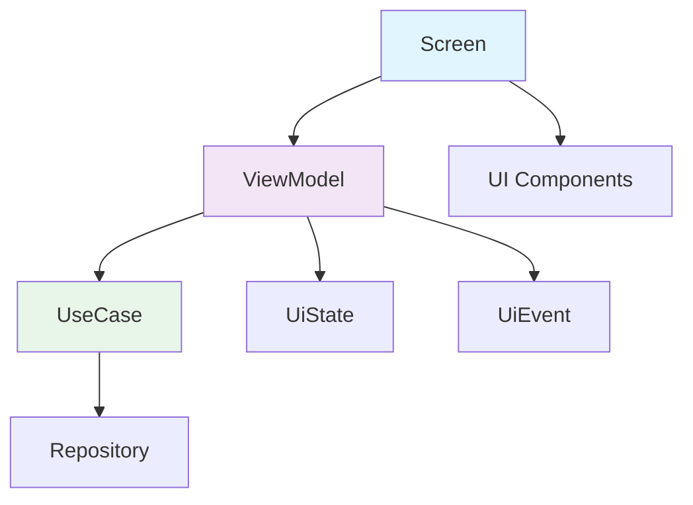

# Presentation ViewModel 模块文档

> [根目录](../../../../CLAUDE.md) > [项目文档](../../README.md) > [presentation](../README.md) > **viewmodel**

## 模块职责

Presentation ViewModel模块负责MVVM架构的ViewModel层：
- **状态管理**: 管理UI状态
- **业务协调**: 调用UseCase执行业务逻辑
- **数据转换**: 将领域模型转换为UI模型
- **事件处理**: 处理UI事件

## ViewModel列表

### 核心ViewModel

#### ChatViewModel
- **职责**: 聊天界面状态管理
- **状态**: ChatUiState
- **事件**: ChatUiEvent
- **功能**:
  - 发送消息
  - 加载历史消息
  - AI分析
  - 生成回复

#### ContactListViewModel
- **职责**: 联系人列表状态管理
- **状态**: ContactListUiState
- **事件**: ContactListUiEvent
- **功能**:
  - 加载联系人列表
  - 搜索联系人
  - 删除联系人

#### ContactDetailViewModel
- **职责**: 联系人详情状态管理
- **状态**: ContactDetailUiState
- **事件**: ContactDetailUiEvent
- **功能**:
  - 加载联系人详情
  - 更新画像
  - 管理标签
  - 管理事实

#### SettingsViewModel
- **职责**: 设置界面状态管理
- **状态**: SettingsUiState
- **事件**: SettingsUiEvent
- **功能**:
  - 加载设置
  - 更新设置
  - 测试API连接

#### PromptEditorViewModel
- **职责**: 提示词编辑器状态管理
- **状态**: PromptEditorUiState
- **事件**: PromptEditorUiEvent
- **功能**:
  - 加载提示词
  - 编辑提示词
  - 保存提示词
  - 预览提示词

#### BrainTagViewModel
- **职责**: 脑标签管理状态
- **状态**: BrainTagUiState
- **事件**: BrainTagUiEvent
- **功能**:
  - 加载标签列表
  - 创建标签
  - 编辑标签
  - 删除标签

### 其他ViewModel

- `AiConfigViewModel` - AI配置管理
- `UserProfileViewModel` - 用户画像管理
- `FloatingWindowViewModel` - 悬浮窗管理
- `MainViewModel` - 主界面状态
- `ConversationViewModel` - 对话管理
- `TopicViewModel` - 主题管理
- `NavigationViewModel` - 导航状态

## 架构设计



## 设计模式

### 1. 状态管理
```kotlin
@HiltViewModel
class ExampleViewModel @Inject constructor(
    private val useCase: ExampleUseCase
) : ViewModel() {

    private val _uiState = MutableStateFlow(ExampleUiState())
    val uiState: StateFlow<ExampleUiState> = _uiState.asStateFlow()

    fun onEvent(event: ExampleUiEvent) {
        when (event) {
            is ExampleUiEvent.LoadData -> loadData()
            is ExampleUiEvent.Refresh -> refresh()
        }
    }

    private fun loadData() {
        viewModelScope.launch {
            _uiState.update { it.copy(isLoading = true) }
            useCase()
                .onSuccess { data ->
                    _uiState.update { it.copy(data = data, isLoading = false) }
                }
                .onFailure { error ->
                    _uiState.update { it.copy(error = error.message, isLoading = false) }
                }
        }
    }
}
```

### 2. UiState定义
```kotlin
data class ExampleUiState(
    val isLoading: Boolean = false,
    val data: List<Item> = emptyList(),
    val error: String? = null
)
```

### 3. UiEvent定义
```kotlin
sealed interface ExampleUiEvent {
    data object LoadData : ExampleUiEvent
    data object Refresh : ExampleUiEvent
    data class DeleteItem(val id: String) : ExampleUiEvent
}
```

## 最佳实践

### 1. 单一职责
- 每个ViewModel只负责一个页面
- 保持ViewModel简洁
- 复杂逻辑提取到UseCase

### 2. 状态管理
- 使用StateFlow管理状态
- 状态应该是不可变的
- 使用copy()更新状态

### 3. 生命周期
- 使用viewModelScope
- 在onCleared()中清理资源
- 避免内存泄漏

### 4. 错误处理
- 统一的错误处理
- 用户友好的错误信息
- 错误恢复机制

## 相关文件清单

### ViewModel实现
- `ChatViewModel.kt` - 聊天ViewModel
- `ContactListViewModel.kt` - 联系人列表ViewModel
- `ContactDetailViewModel.kt` - 联系人详情ViewModel
- `SettingsViewModel.kt` - 设置ViewModel
- `PromptEditorViewModel.kt` - 提示词编辑ViewModel
- `BrainTagViewModel.kt` - 脑标签ViewModel

## 变更记录

### 2025-12-25 - 初始创建
- 创建presentation/viewmodel模块文档
